# Object Detection with Faster R-CNN

> Fine-tuned Faster R-CNN (ResNet-50 FPN) for two real-world object detection tasks — **pedestrian detection** on PennFudanPed and **dog detection** on the Stanford Dogs dataset — built end-to-end in PyTorch.


---

## Overview

This project demonstrates the complete lifecycle of a deep-learning object detection pipeline:

1. **Custom Dataset Classes** — parsed two heterogeneous annotation formats (plain-text masks for PennFudanPed, VOC/XML for Stanford Dogs) into a unified PyTorch `Dataset` interface.
2. **Transfer Learning** — loaded COCO-pretrained Faster R-CNN weights and replaced the classification head to adapt to binary detection (background vs. person / background vs. dog).
3. **End-to-end Training** — trained with the Adam optimiser on GPU for up to 50 epochs, tracking four simultaneous Faster R-CNN losses.
4. **Evaluation & Visualisation** — compared predicted and ground-truth bounding boxes on held-out validation images, and ran inference on never-seen test images.

**Why it matters:** Pedestrian detection underpins autonomous vehicles and surveillance systems; breed/animal detection is the basis of wildlife monitoring and consumer AI apps. Both tasks share an identical pipeline, demonstrating architecture reusability across domains.

---

## Key Highlights

- **Faster R-CNN with ResNet-50 FPN** — state-of-the-art two-stage detector with multi-scale feature pyramid network backbone.
- **Transfer Learning from COCO** — leverages 80-class pretrained weights; only the box predictor is retrained, making training fast even on a small dataset.
- **Custom `Dataset` + `DataLoader`** — handles varying bounding-box counts per image using a custom `collate_fn` that avoids fixed-size batching.
- **Dual loss tracking** — simultaneously monitors `loss_classifier`, `loss_box_reg`, `loss_objectness`, and `loss_rpn_box_reg` epoch-by-epoch.
- **Score serialisation** — epoch-level and batch-level losses are stored as a `pkl` file for offline analysis and reproducibility.
- **Multi-domain testing** — model is evaluated on real-world photographs never seen during training (crowded street scenes, Chihuahua portrait).

---

## Architecture & Pipeline

```
Raw Images + Annotations
        │
        ▼
 ┌──────────────────┐
 │  Custom Dataset  │  ← Parses text masks (PennFudan) / XML VOC (Dogs)
 │  + DataLoader    │  ← custom collate_fn, 80/20 train-val split
 └────────┬─────────┘
          │  (image tensor, target dict: boxes + labels)
          ▼
 ┌────────────────────────────────────────────────────────┐
 │              Faster R-CNN (ResNet-50 FPN)              │
 │                                                        │
 │  Backbone  →  FPN  →  RPN  →  RoI Align  →  Predictor │
 │ ResNet-50    multi    region   crop &        2-class   │
 │ (COCO       scale    proposal  pool         head       │
 │  weights)   feats    network                (retrained)│
 └────────────────────────────────────────────────────────┘
          │
          │  Training: 4 losses summed → Adam (lr=1e-4)
          │  Inference: filtered by score threshold (≥0.5)
          ▼
  Bounding Boxes + Confidence Scores
```

---

## Datasets

| Dataset | Task | Total Images | Train | Val | Annotation Format |
|---|---|---|---|---|---|
| [PennFudanPed](https://www.cis.upenn.edu/~jshi/ped_html/) | Pedestrian detection | 170 | 136 | 34 | Text (mask-derived bounding boxes) |
| [Stanford Dogs](http://vision.stanford.edu/aditya86/ImageNetDogs/) (Chihuahua) | Dog detection | 152 | 121 | 31 | VOC XML |

- **PennFudanPed** — urban scenes containing 1–3 pedestrians per image. Images are PNG format, annotated with pixel-level masks from which axis-aligned bounding boxes are derived.
- **Stanford Dogs (Chihuahua subset)** — high-quality breed-specific images in varying poses and backgrounds. Annotations are standard ImageNet VOC XML with `<xmin>`, `<ymin>`, `<xmax>`, `<ymax>` bounding boxes.

---

## Training Configuration

| Hyperparameter | Pedestrian Model | Dog Model |
|---|---|---|
| Backbone | ResNet-50 FPN | ResNet-50 FPN |
| Pretrained weights | COCO DEFAULT | COCO DEFAULT |
| Num classes | 2 (bg + person) | 2 (bg + dog) |
| Optimizer | Adam | Adam |
| Learning rate | 1e-4 | 1e-4 |
| Batch size | 4 | 4 |
| Epochs | 50 | 10 |
| Device | CUDA (GPU) | CUDA (GPU) |
| Score threshold | 0.5 | 0.5 |
| Initial train loss | 0.304 | 0.167 |
| Final train loss | **0.020** | **0.045** |
| Final val loss | **0.092** | **0.112** |

---

## Visualisations

### Pedestrian Detection — PennFudanPed

**Sample dataset images with ground-truth bounding boxes**

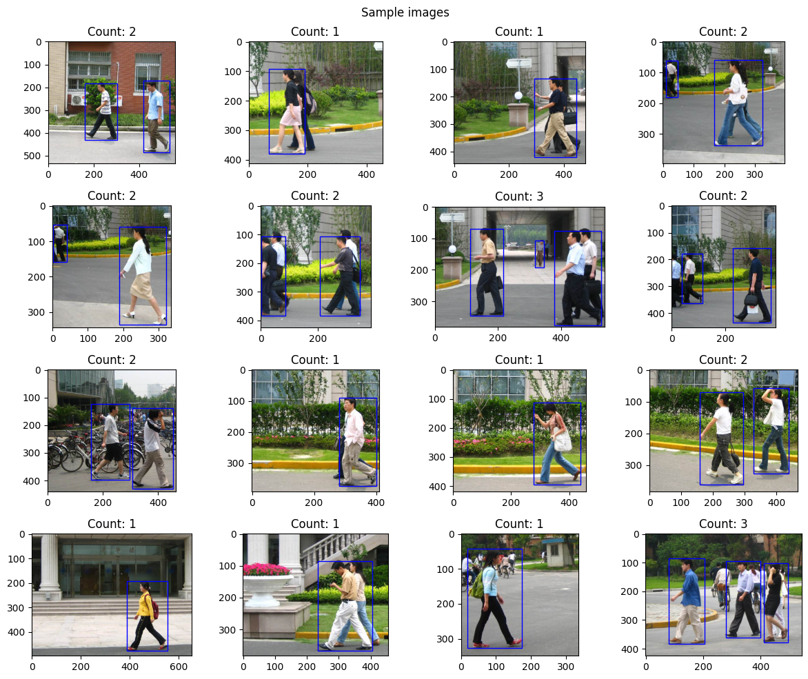

---

**Training & validation loss curves (50 epochs)**

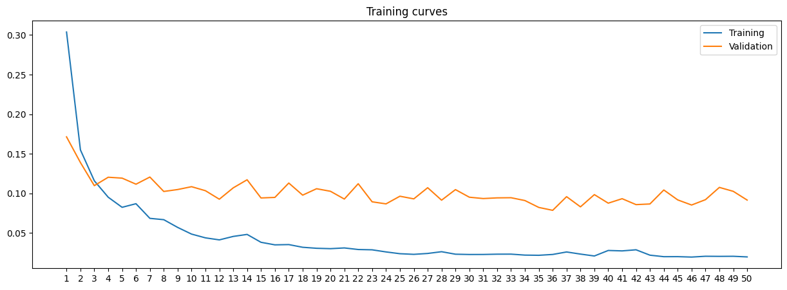

> Training loss fell from **0.304 → 0.020** (~93 % reduction). Validation loss fell from **0.171 → 0.092** (~46 % reduction), tracking training closely without significant divergence — indicating that the model generalised well and did not overfit, likely aided by the strong COCO-pretrained backbone. Both curves plateau after epoch ~30, suggesting the learning rate could be decayed for further gains.

---

**Epoch-wise component losses**

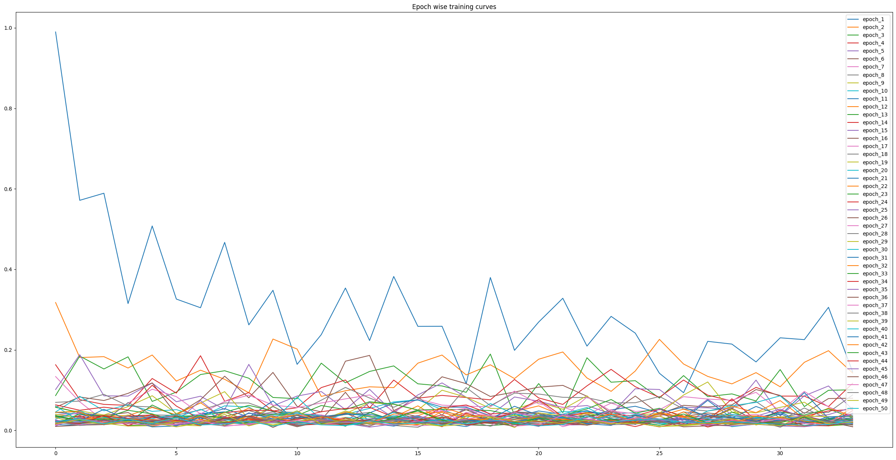

---

**Validation predictions (Red) vs Ground-truth (Blue)**

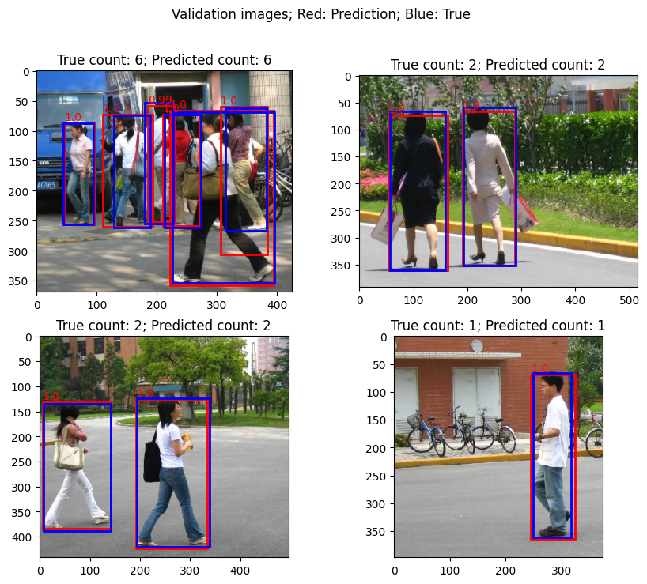

---

**Test image 1 — real-world street scene**

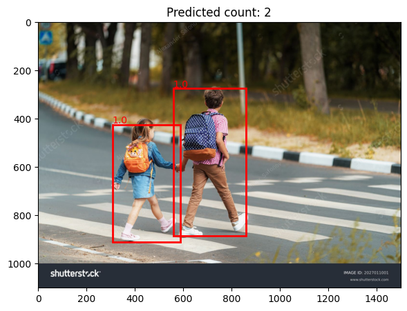

**Test image 2 — real-world street scene**

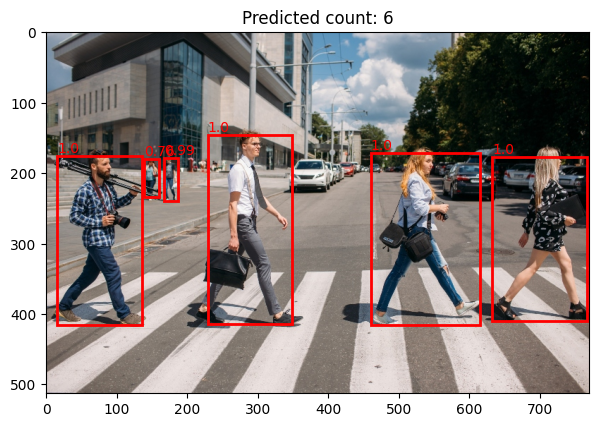

---

### Dog Detection — Stanford Dogs (Chihuahua)

**Sample dataset images with ground-truth bounding boxes**

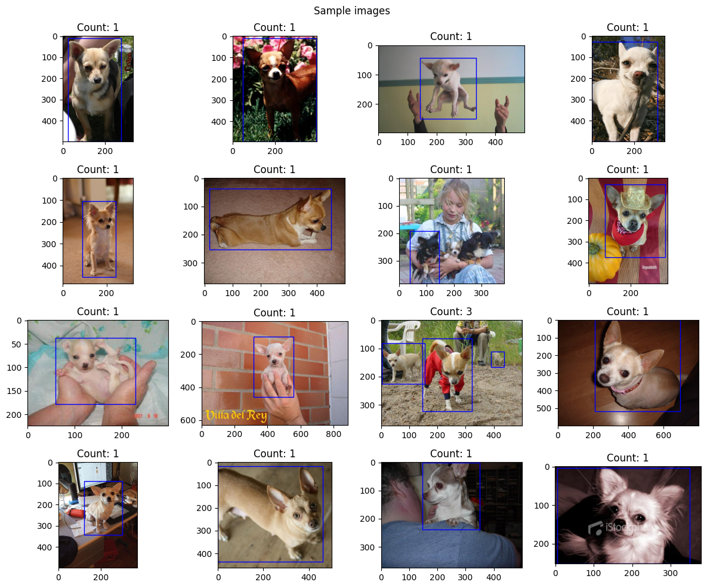

---

**Training & validation loss curves (10 epochs)**

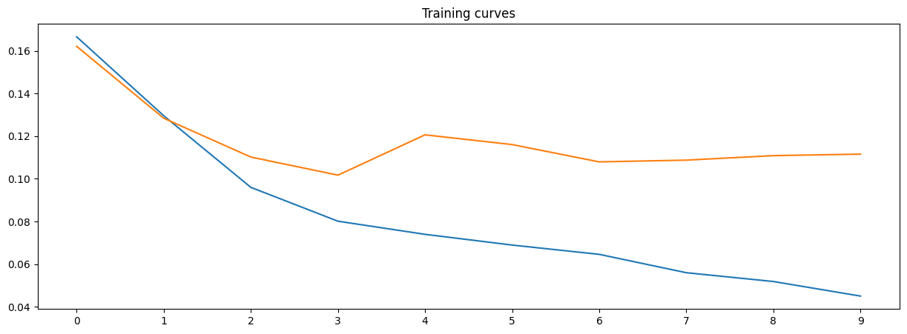

> Training loss dropped from **0.167 → 0.045** (~73 % reduction). Validation loss settled around **0.112**, plateauing after epoch 3 — the low epoch count (10) was sufficient for this smaller dataset thanks to the pretrained feature extractor. The train–val gap stays narrow, confirming no overfitting on the 121-image training set.

---

**Epoch-wise component losses**

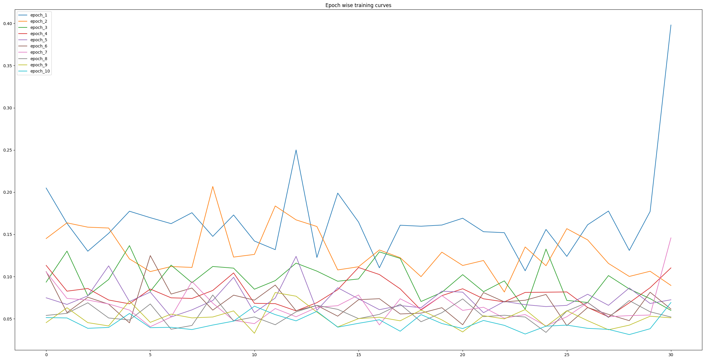

---

**Validation predictions (Red) vs Ground-truth (Blue)**

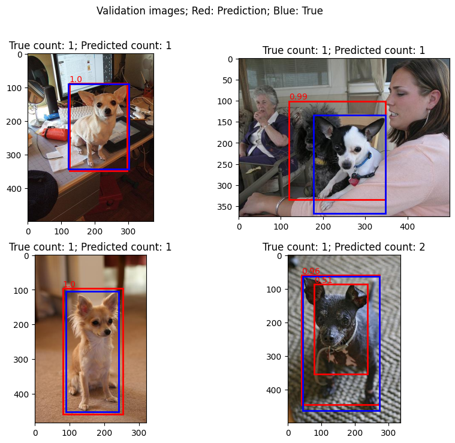

---

**Test image — Chihuahua portrait**

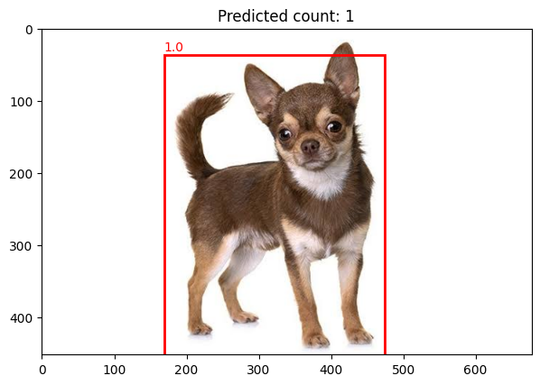

---

## Project Structure

```
object-detection-faster-rcnn/
│
├── penn0.ipynb                   # Main notebook: pedestrian detection
│   ├── Custom PennFudanPed Dataset class
│   ├── 80/20 split, DataLoader
│   ├── Faster R-CNN fine-tuning (50 epochs)
│   ├── Loss curves & validation visualisation
│   └── Inference on unseen test images
│
├── Archive/
│   └── penn_detection.ipynb      # Dog detection notebook (Stanford Dogs)
│       ├── Custom Dataset with VOC XML parsing
│       ├── Faster R-CNN fine-tuning (10 epochs)
│       └── Inference on Chihuahua test image
│
├── PennFudanPed/                 # Pedestrian dataset
│   ├── PNGImages/                # 170 PNG images
│   ├── Annotation/               # Text annotation files
│   └── PedMasks/                 # Segmentation masks (used to derive boxes)
│
├── Archive/Stanford-Dogs/        # Chihuahua subset
│   ├── Images/n02085620-Chihuahua/   # 152 JPEG images
│   └── Annotation/n02085620-Chihuahua/  # VOC XML annotations
│
├── assets/                       # Result images (auto-extracted from notebooks)
│   ├── ped_sample_with_bbox.png
│   ├── ped_sample_grid.png
│   ├── ped_training_curves.png
│   ├── ped_epoch_wise_curves.png
│   ├── ped_validation_predictions.png
│   ├── ped_test_image1_predictions.png
│   ├── ped_test_image2_predictions.png
│   ├── dog_sample_with_bbox.png
│   ├── dog_sample_grid.png
│   ├── dog_training_curves.png
│   ├── dog_epoch_wise_curves.png
│   ├── dog_validation_predictions.png
│   └── dog_test_chihuahua_predictions.png
│
├── penn_scores.pkl               # Serialised pedestrian training history
├── test_image.jpg                # Pedestrian test image 1
├── test_image2.jpg               # Pedestrian test image 2
├── Archive/dog_scores.pkl        # Serialised dog training history
├── Archive/test_chihuahua.jpg    # Dog test image
├── .gitignore                    # Excludes model weights, zips, __pycache__
└── README.md
```

> **Note:** `penn_model.pth` (159 MB) and `dog_model.pth` (159 MB) are excluded from the repository by `.gitignore` due to GitHub's 50 MB file-size limit.

---

## Setup & Usage

### 1. Clone the repository

```bash
git clone https://github.com/Rakshithch/object-detection-faster-rcnn.git
cd object-detection-faster-rcnn
```

### 2. Install dependencies

```bash
pip install torch torchvision pillow numpy pandas matplotlib
```

> A CUDA-capable GPU is recommended for training. CPU inference works but will be slow.

### 3. Download datasets

- **PennFudanPed** — already included in `PennFudanPed/`.
- **Stanford Dogs (Chihuahua)** — included in `Archive/Stanford-Dogs/`.

### 4. Run the notebooks

```bash
jupyter notebook penn0.ipynb                    # Pedestrian detection
jupyter notebook Archive/penn_detection.ipynb   # Dog detection
```

### 5. Run inference on a custom image

```python
import torch
from PIL import Image
from torchvision import transforms
from matplotlib import pyplot as plt
from matplotlib.patches import Rectangle

# Load trained model (download separately — see note above)
model = torch.load("penn_model.pth", map_location="cpu")
model.eval()

transform = transforms.ToTensor()
img = Image.open("your_image.jpg").convert("RGB")
tensor = transform(img).unsqueeze(0)

with torch.no_grad():
    output = model(tensor)[0]

fig, ax = plt.subplots()
ax.imshow(img)
for box, score in zip(output["boxes"], output["scores"]):
    if score > 0.5:
        x1, y1, x2, y2 = box
        ax.add_patch(Rectangle([x1, y1], x2-x1, y2-y1,
                                fill=False, lw=2, edgecolor="red"))
plt.title(f"Detected: {(output['scores'] > 0.5).sum().item()} objects")
plt.show()
```

---

## Tech Stack

| Category | Technology |
|---|---|
| Language | Python 3.9+ |
| Deep Learning | PyTorch 2.x |
| Computer Vision | torchvision (Faster R-CNN, ResNet-50 FPN) |
| Data Handling | torch.utils.data (Dataset, DataLoader) |
| Image Processing | Pillow (PIL) |
| Annotation Parsing | xml.etree.ElementTree (VOC XML) |
| Numerical Computing | NumPy |
| Data Analysis | Pandas |
| Visualisation | Matplotlib |
| Hardware | NVIDIA CUDA GPU |
| Environment | Jupyter Notebook |

---

## Skills Demonstrated

| Skill | Evidence |
|---|---|
| **Transfer Learning** | COCO-pretrained Faster R-CNN backbone reused; only the prediction head retrained |
| **Object Detection** | Two-stage detector (RPN + RoI Align) fine-tuned end-to-end |
| **Custom Dataset Design** | `torch.utils.data.Dataset` subclass for two annotation formats |
| **Data Pipeline Engineering** | Custom `collate_fn` for variable-length bounding-box batches |
| **Feature Pyramid Networks** | Multi-scale detection using FPN for small/large object handling |
| **Training Loop Design** | Manual training loop with gradient computation, optimiser step, eval mode switching |
| **Loss Analysis** | Tracking 4 simultaneous Faster R-CNN losses; epoch & batch-level serialisation |
| **GPU Acceleration** | CUDA device management with `model.to(device)`, `tensor.to(device)` |
| **Model Serialisation** | Saving/loading model weights and training history (`torch.save`, `torch.load`) |
| **Multi-domain Generalisation** | Same pipeline successfully applied to both pedestrian and animal detection |
| **Bounding Box Visualisation** | Matplotlib `Rectangle` patches for overlaid prediction vs. ground-truth plots |
| **Evaluation Methodology** | Score-threshold filtering, validation set inference, qualitative + quantitative assessment |
| **Reproducibility** | Loss history serialised to `.pkl`; `.gitignore` excludes environment-specific files |

---

## Results Summary

| Metric | Pedestrian Model | Dog Model |
|---|---|---|
| Training epochs | 50 | 10 |
| Train loss (epoch 1) | 0.304 | 0.167 |
| Train loss (final) | 0.020 | 0.045 |
| Val loss (final) | 0.092 | 0.112 |
| Train loss reduction | **93 %** | **73 %** |
| Test prediction (image 1) | 2 persons detected | 1 dog detected |
| Overfitting observed | Minimal | Minimal |

---

## Author

**Rakshith C H**
GitHub: [https://github.com/Rakshithch](https://github.com/Rakshithch)
